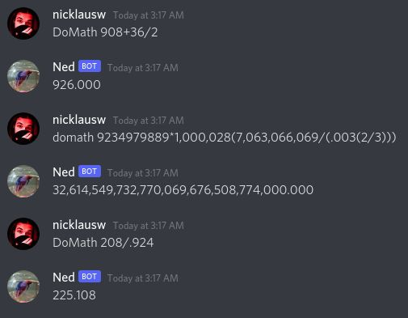

# comparse: CObol Math PARSE
This is a math parser written in gnuCOBOL for fun. It interfaces with the [Concord library](https://github.com/Cogmasters/concord/tree/dev) to take in statements via Discord, and uses [MPFR](https://www.mpfr.org/) for arbitrary precision (AKA giant numbers).



## why?
To satisfy my own curiosity, and hopefully yours aswell. Writing a math parser is easy; writing one in a language based around tons of random keywords that the entire industry gave up on is a different story. Want to hire me to work on your COBOL project? I'd love to help! [Hit me up.](https://www.nicklausw.com/contact)

## what's with the bit precision?
Comparse can display up to 1498 digits in a message due to commas and the decimal place. 1498 digits can be any of 10^1498 different numbers. x bits can represent 2^x different numbers. So you solve:
```
2^x = 10^1498
x = log2(10^1498)
x = 1498*log2(10)
```
...equals 4976.25 rounded up to 4977 bits of precision. For a nice even number divisible by 8, we use 4984.

## aren't these lines a bit long for COBOL?
gnuCOBOL offers two modes for reading lines: free mode and fixed mode. Fixed mode is based off the design of a punch card, with the first 6 columns kept empty, the ridiculously short cutoff point, and so on. Free mode has fewer constraints and allows each line to go up to 255 characters. I'm using free mode for my sanity.

## will you redo the discord stuff in COBOL?
If I can properly replicate the structs in COBOL then maybe. Currently it's a no. Implementing MPFR was really luck of the draw because all of its functions allow you to pass a pointer and nothing else, so COBOL doesn't have to know the internals of what that pointer is working with.